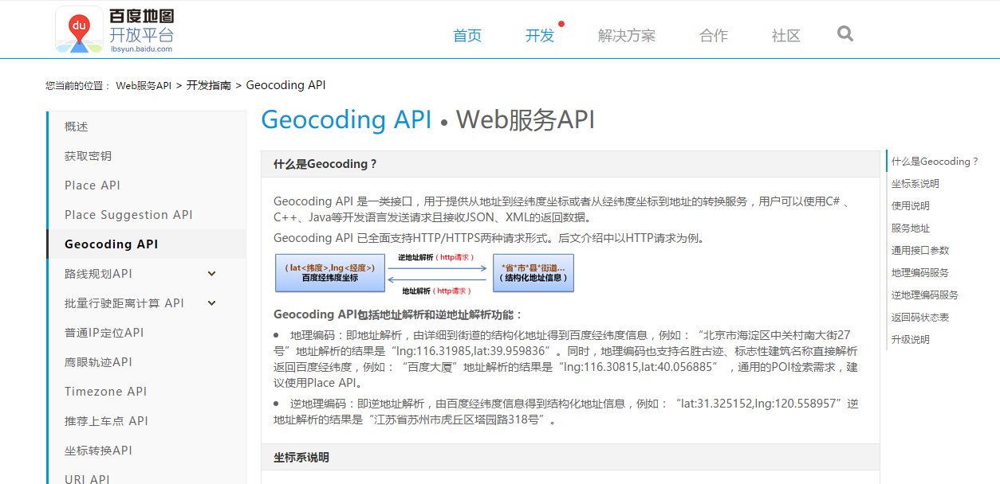

[TOC]

### 有话说

在当前的大数据和人工智能的浪潮下，铺天盖地都是数据挖掘、机器学习和人工智能，基础就是数据，就像在地理信息领域一直说的一句话 “数据是GIS的血液”，那么推广到现在的人工智能，大数据就是人工智能的血液，没有数据就无从谈起人工智能。

在地理信息领域，一直存在的一个关键词就是（反）地理编码，地理编码是较为常用的一项地理信息技术，现在很多对于大量关于位置的信息都是存储为地址的形式，例如 “上海市闵行区东川路500号”，而在有关空间分析的时候是不能很好的利用这些文本地址数据去进行空间化，而是需要将其转换为一个个的地理坐标（经纬度），然后进行空间化，这样就能在传统的分析基础上，增加空间维度，使得数据分析具有空间上的意义，比如空间聚类、地理加权回归以及空间可视化。

本文围绕百度地图（反）地理编码进行记录。

### （反）地理编码简述

>- 地理编码又称地址匹配，就是指将要素的地址信息（如所在的城市、路名、门牌号和邮政编码等）转换为地理坐标信息。

>+ 反地理编码，即为地理编码的逆向过程，就是将将地理坐标转换为标准地址。

>- 地理编码服务：有很多的地图公司都提供的了在线的地理编码服务，如百度地图、谷歌地图以及高德地图等等。

### 地理坐标系统

地理坐标的数值只有在一个标准的地理坐标系统环境下，才是有意义的，在地理学上，比较常见的就是地理坐标和投影坐标，此处只看地理坐标。

在国内较为常见的地理坐标系统包括WGS84，即GPS上使用的坐标系；国测局坐标，又称火星坐标系，简称GCJ02；另外就是百度坐标。
>- 注：百度坐标是在火星坐标系上进一步进行加密，也只有百度地图使用；
>+ 火星坐标一般是国内常用的地图公司，如高德、腾讯和搜狗地图等等。
>- WGS84 坐标系是国家标准，常见的谷歌地图、osm等。

此文使用的是百度地图的地理编码服务，故地理编码返回的是百度坐标，然后利用转换公式将其转换为WGS-84 坐标。

### 百度地图地理编码服务
#### 1. 百度地图地理编码服务



[百度地图地理编码服务](http://lbsyun.baidu.com/index.php?title=webapi/guide/webservice-geocoding)主界面如上，该服务提供的接口可以将地理转换为经纬度或将经纬度转换为地址，对于语言没有限制，返回的格式为JSON或XML。
帮助非常详细，此处不再冗余说明。

#### 2. Python 代码

利用Python进行网络请求，这就需要一些模块的支持，如**urllib2**用于请求服务接口，**json**用于解析返回的数据包，**time**用于持续请求的控制，过快频繁的请求会让服务器压力增大，进而可能会收到空的数据包或者返回异常，所以建议请求一定次数后间隔一段时间再发出请求，**math**模块用于公式的转换。
**重要的是ak，一定要申请，最好实名认证一下，这样可以增加每天的请求次数**。

```python
# geocoding service address
urlService = "http://api.map.baidu.com/geocoder/v2/"
```

```python
# coding params
paramsCode = {"ak":"your ak","output":"json","callback":"showLocation"}
# recoding params
paramsRecode = {"ak":"your ak","output":"json","callback":"renderReverse"}
```

```python
# url request for response
def urlRequest(url, params):
    request = urllib2.Request(url, urllib.urlencode(params))
    html = "{'status':1,'result':{'location':{'lng':0,'lat':0},'precise':0,'confidence':0,'level':'ok'}}"
    try:
        response = urllib2.urlopen(request)
        html = response.read()
        response.close()
        time.sleep(0.3)   # sleep for 0.3 seconds at once
    except Exception as err:   # detect the Exception
        print err
        time.sleep(300)
    finally:
        return html
```

```python
# transfer Json text obj to Json python object
def objToJson(docJson):
    objJson = json.loads(docJson)   # Deserialize 'docJson'(a 'str' or 'unicode' instance containing a JSON document) to a Python object
    return objJson
```

```python
# transfer address to LngLat
def AddrToLngLat(address, city='上海'): # 请求参数address(必须)/city(非必须，默认"北京市")
    location = {}
    paramsCode["address"] = address
    paramsCode["city"] = city
    content = objToJson(urlRequest(urlService,paramsCode))
    
    status = content['status'] #返回结果状态
    if status == 0:
        result = content['result'] #返回结果
        location = result['location'] #object类型,经纬度坐标
        precise = result['precise'] #位置附加信息，是否精确查找。1为精确查找，0为模糊打点
        confidence = result['confidence'] #可信度，描述打点精确度
        level = result['level'] #地址类型
        return location
    else:
        return {'lat':0,'lng':0}
```

```python 
# transfer LngLat to address
def LngLatToAddr(location,coordtype='wgs84ll',pois=0): # 请求参数location(必须)/coordtype(非必须，默认"bd09ll")/pois(非必须，默认"0")
    paramsRecode['location'] = location
    paramsRecode['coordtype'] = coordtype
    paramsRecode['pois'] = pois
    content = objToJson(urlRequest(urlService,paramsRecode))

    status = content['status'] #返回结果状态
    result = content['result'] #返回结果
    formatted_address = result['formatted_address'] #结构化地址信息
    business = result['business'] #所在商圈信息，如"人民大学,中关村,苏州街"
    addressComponent = result['addressComponent'] #组成地址的各部分信息
    pois = result['pois'] #周边POI数组，数组元素又包含商圈的基本信息
    sematic_description = result['sematic_description'] #当前位置结合POI的语义化结果描述
    return formatted_address    
```

以上的代码能够完整的进行（反）地理编码，但是地理编码返回的是百度坐标系，在大多数的分析软件中的是不支持的，比如ArcGIS，接下来就需要将其转换为WGS-84坐标系，以便后续的利用。
此公式是一个较为常用的，亲测可行。
```python
# convert Baidu Coordinates to WGS84 that used more
def convert(bd_lat,bd_lng):
    import math
    pi = math.pi*3000.0 / 180.0
    x = bd_lng - 0.0065
    y = bd_lat - 0.006
    z = math.sqrt(x*x+y*y) - 0.00002*math.sin(y*pi)
    theta = math.atan2(y,x) - 0.000003*math.cos(x*pi)
    lng = z*math.cos(theta)
    lat = z*math.sin(theta)
    data = [str(lat), str(lng)]
    return data
```
