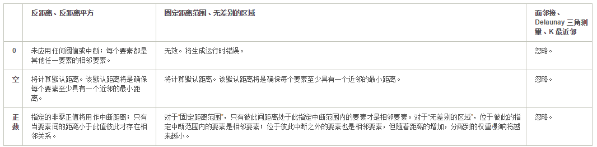
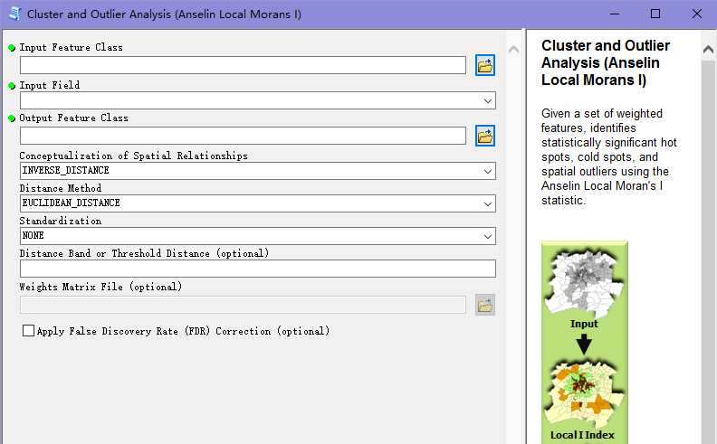
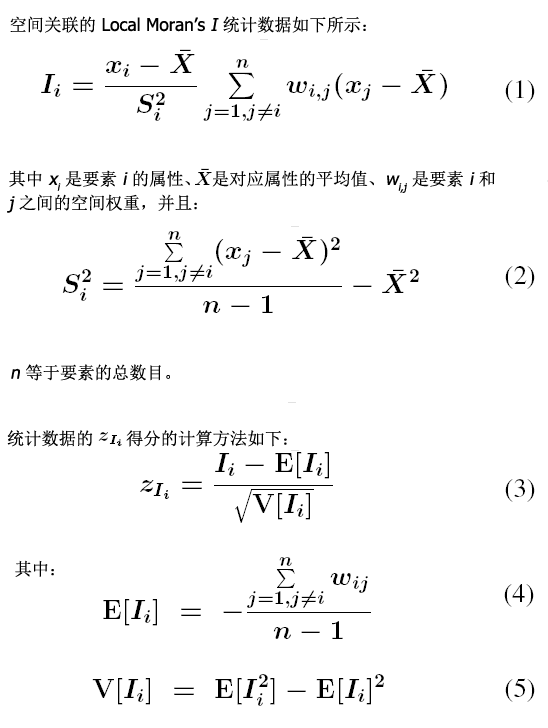

传统的空间聚类模式识别是基于一个空间聚类分析来识别具有统计显著性的热点、冷点和空间异常值的位置。

### 空间关系建模基础概念
**注意事项**:
>- 空间统计中基于欧氏距离或曼哈顿距离来度量距离，总是针对投影数据来进行的操作，所以在运用之前一定要将地理数据转换为投影数据；
>- 使用shapefile时，不能存储空值（<b>特别注意可能在数据处理过程中会将空值存储为0或者极大的负值</b>）

#### 1.空间关系概念化  Conceptulization of Spatial  Relationships
**适用**：空间自相关（global Moran’s I）、聚类和异常值分析（Anselin local Moran's I）、热点分析（Getis-Ord Gi*）等，注意某些选项只有在生成`空间权重矩阵`或生成`网络空间权重`时才可用。

1. 反距离、反距离平方（阻抗）
使用“反距离”选项时，空间关系的概念模型是一种阻抗或距离衰减。任何要素都会影响其他所有要素，但距离越远，影响越小。使用反距离这一概念化表述时，通常要指定一个距离范围或距离阈值以减少所需的计算数（尤其对于大型数据集而言）。
反欧氏距离适用于对连续数据（如温度变化）进行建模。当分析涉及硬件存储的位置或其他固定的城市设施位置时，道路网络数据不再适用，而反曼哈顿距离可能最为合适。

2. 固定距离范围（影响的范围）
对于某些工具（如热点分析），固定距离范围是默认空间关系的概念化。通过“固定距离范围”选项，可以对数据施加一个空间交互的影响范围或移动窗口概念模型。只为在距离范围内的每个要素进行分析，权重相等，范围外的不参与运算，权重为0。

3. 无差别的区域
该选项是将“反距离”模型和“固定距离范围”模型合并为一体。距离范围或距离阈值内的所有要素都包含在对目标要素的分析中，超过关键距离后，影响级别（权重）会快速下降。
这种情况下，距离会变得更像是阻抗并且可能影响到最终决策。

4. 面邻接（一阶）
对于面要素类，可选择 CONTIGUITY_EDGES_ONLY（有时称为 Rook's Case）或 CONTIGUITY_EDGES_CORNERS（有时称为 Queen's Case）。对于 EDGES_ONLY，共享边（具有重合边界）的面包含在目标面的计算中。不共享边的面被排除在目标要素计算之外。对于 EDGES_CORNERS，共享边和/或角的面包含于目标面的计算中。

5. K最近邻域
构造邻域关系，以便每个要素都可在其指定数量的最近邻域空间环境内进行评估。该种方式在要素密度高的位置处，分析的空间范围会比较小。与此类似，要素密度稀的位置，分析的空间范围会比较大。
应用于`生成空间权重矩阵（Generate Spatial Weights Matrix）`工具，以结合探索性回归评估回归残差。相邻要素数目设置为8。

6. Delaunay三角测量（自然邻域）
使用“Delaunay 三角测量”选项可构造邻域，方法是通过点要素或要素质心创建 Voronoi 三角形，使得每个点/质心都是三角形结点。由三角形的边连接的结点被视为相邻结点。使用 Delaunay 三角测量可确保每个要素至少具有一个邻域，即使数据包含岛和/或变化明显的要素密度。可用于`生成空间权重矩阵`工具中。
注：有要素重合时不可使用。

7. 空间时间窗
根据空间窗（固定距离）和时间窗（固定时间间隔）来定义要素的关系。当使用`生成空间权重矩阵`工具创建空间权重矩阵文件时，此选项可用，且以此配合热点分析空间-时间热点。

8. 通过文件获取空间权重
可用于`生成空间权重矩阵`工具或`生成网络空间权重`工具来创建存储要素邻域关系的文件。
例如要使用根据网络数据集获得的行程时间或行程成本来定义空间关系，可使用生成网络空间权重工具创建空间权重矩阵文件，然后使用得到的 SWM 文件进行分析。

#### 2.距离范围或距离阈值  distance band/ threshold distance
使用距离范围或距离阈值可设置大多数空间关系的概念化（例如，反距离、固定距离范围）的分析比例。
使用“无差别的区域 ZONE_OF_INDIFFERENCE”时，指定距离之外的要素的影响会随邻近程度的减小而变弱，而距离阈值之内的影响则视为是相等的。
空间关系的概念化参数的不同选项对于三种可能的输入类型（负值无效）的行为方式如下：

#### 3.权重矩阵
空间权重是反映数据集中每个要素和其他任何一个要素之间的距离、时间或其他成本的数字，格式可为ASCII文件。
**格式**：
第一行是唯一ID字段的名称，每个要素具有唯一值；后面的每行为三列，分别为起始要素ID、终止要素ID和权重。
注：权重在表示距离或时间会被取到数。

### 聚类和异常值分析
ArcGIS中的`Cluster and Outlier (Anselin Local Morans I)`工具

**1.作用**：该工具是根据指定的分析字段来识别高值或低值的要素在空间上的聚类，同时可以识别异常值。计算结果有`local Moran's I指数`、`z得分`、`p值`和每个具有显著统计学意义的要素的聚类所属类型的编码，其中z得分和p值表示计算出的local Moran's I指数的统计显著性。

**2.公式**：

**3.解释**：
>- local Moran's I：正值表示要素周围具有同样高或低的邻近要素；负值表示要素周围具有不同值的邻近要素，即为异常值。
    - 注：被视为统计学上显著性的聚类和异常值，其对应的p值必须足够小
>- 聚类/异常值类型 (COType) 字段：HH聚类、LL聚类；HL聚类、LH聚类（异常值）。

**4.应用准则**：
>- 要素至少包括30个；
>- 输入字段为数值型，如果是点数据，则无需特定数值属性；
>- 如果查找多个事件点或少许事件点的位置，可用热点分析工具`Getis-Ord Gi*`；
    - 注：只有聚类和异常值分析`Anselin Local Moran's I`工具可以识别统计学显著性和空间异常值（HL/LH）
>- 合适的距离范围或阈值范围；
    - 所有要素至少具有一个相邻要素
    - 任何要素都不应该将其它所有要素都作为相邻要素
    - 输入字段的值有偏斜时，每个要素应具有大约八个相邻要素

**5.应用**：
>- 犯罪的高低值边界；
>- 空间异常点检测。

**6.实例**:
上海市两抢一盗

### 热点分析（Geti-Ord  Gi*）
ArcGIS中的`Hot Spot Analysis（Getis-Ord Gi*）`工具

热点分析工具是对数据集中的每一个要素计算Getis-Ord Gi*。然后通过z得分和p值，即可知道高值或低值要素在空间上发生聚类的位置。
**1.原理**：高值要素很容易发现，但是有可能不具有统计学意义，所以要根据邻近要素是否为高值，且同样被邻近高值要素环绕。
量化：某个要素及其相邻要素的局部总和将与所有要素的总和进行比较；当局部总和与所预期的局部总和有很大差异，以致于无法成为随机产生的结果时，会产生一个具有显著统计学意义的 `z 得分`。

**2.公式**:

**3.解释**：
具有显著统计学意义的z得分，正值z越大，则热点的聚类越紧密，反之负值z越小，则冷点的聚类就越紧密。

**4.注意**：
>1. 分析字段：热点分析评估的是值在空间上的高低聚类情况，包含该类值的字段为输入字段。特别注意的是点事件数据，针对该类分析是关注于点密度，热点分析工具不能直接完成此操作，需要将点数据先进行聚合，如在格网上进行计数、某个点一定范围内的点数量等，然后以此点计数字段作为输入字段；
>2. 参数选取
    - 空间关系的概念化（Conceptualization of Spatial Relationships）：默认FIEXD_DISTANCE_BAND(推荐)
    - 距离范围（Distance Method）：
    - 距离阈值（Threshold Distance）：

**5.应用准则**：
>1. 输入要素类至少包含30个要素；
>2. 空间关系概念化推荐FIXED_DISTANCE_BAND；
>3. 距离范围或距离阈值
    - 所有要素至少具有一个相邻要素；
    - 任何要素都不应该将其它所有要素都作为相邻要素；
    - 输入字段的值有偏斜时，每个要素应具有大约八个相邻要素

### 时空模式挖掘
主要内容包括空间和时间上数据的分布和模式分析。

#### 1.NetCDF 数据结构
全称是网络公用数据格式，是一种用来存储温度、湿度、气压、风速和风向等多维科学数据（变量）的文件格式。在 ArcGIS 中，通过根据 NetCDF 文件创建图层或表视图，可以用一个维度（例如时间）来显示上述所有变量。
**特性**：自描述性、可移植性、可扩展性
**基本组成**：维度、变量和属性
**ArcGIS中使用**：在MultiDimension Tools 中有多个工具关于NetCDF 的工具可以操作该数据格式。
[ArcGIS 帮助链接](http://desktop.arcgis.com/zh-cn/arcmap/10.4/manage-data/netcdf/about-the-netcdf-tutorial.htm)

#### 2.创建时空立方体
将一组点聚合到时空条柱将其汇总到NetCDF数据结构中，在每个条柱内计算点并聚合指定属性。然后对所有条柱位置评估计数趋势和汇总字段值。

#### 3.新兴时空热点分析
识别时空立方体中点计数或汇总字段聚类中的趋势，类别包括新增的、连续的、加强的、持续的、逐渐减少的、分散的、振荡的以及历史的热点和冷点。

#### 4.挖掘工具